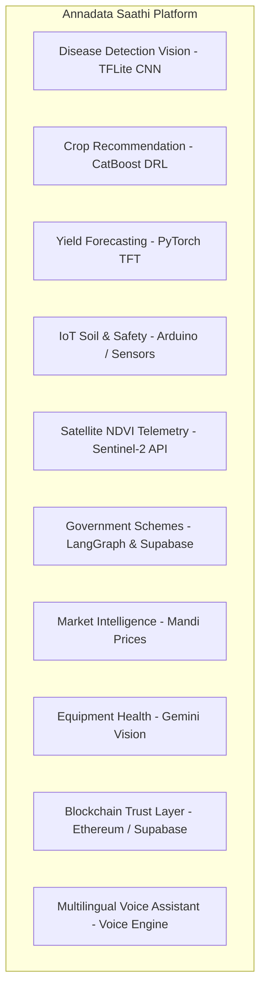
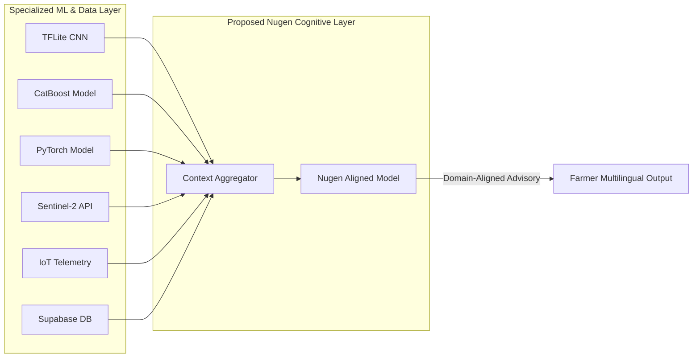

# Annadata Saathi System Context & Proposed Nugen Integration Architecture

This document outlines the architectural context, existing AI/ML model capabilities, current RAG pipeline, and the **proposed integration role** for Nugen aligned-model inference within the Annadata Saathi platform.

---

## 1. Project Overview

**Annadata Saathi** (Let's Go 3.0) is a multi-agent precision agriculture platform designed to empower smallholder Indian farmers with real-time farm intelligence, computer vision diagnostics, IoT automation, satellite monitoring, government scheme access, and supply chain transparency.

### Problem Statement
Indian farmers face severe challenges including fragmented agricultural advice, unpredictable weather patterns, unverified pesticide applications, complex government subsidy procedures, delayed disaster claim payouts, and lack of direct market transparency.

### System Objectives
- Provide accurate, real-time crop disease diagnosis and safe treatment advice.
- Deliver data-driven crop recommendations and yield forecasts linked to Mandi pricing.
- Automate soil telemetry monitoring and smart irrigation pump controls.
- Streamline government scheme discovery, auto-filling, and submission.
- Validate satellite crop loss for accelerated insurance claim verification.

---

## 2. Major System Components



---

## 3. Existing AI/ML Models Summary

| Component | Underlying Model / Framework | Input Data | Output Prediction | Primary Purpose |
| :--- | :--- | :--- | :--- | :--- |
| **Plant Disease Detection** | TFLite CNN (`ensemble_model.tflite`) | $224 \times 224 \times 3$ RGB Image | 38 Disease classes, Softmax Confidence %, HSV Heatmap | Image-based leaf diagnosis |
| **Crop Recommendation** | CatBoost Classifier (`catboost_prod.cbm`) | Soil NPK, pH, moisture, season, previous crop | Top 3 Recommended Crops, Yield ($t/ha$), Risk Score | Seasonal crop selection & ROI |
| **Yield Forecasting** | PyTorch Neural Network / TFT | 5-tuple: `[ndvi, moisture, nitrogen, temp, rainfall]` | Yield tonnage per hectare across 55 crops | Production volume estimation |
| **Equipment Analyzer** | Gemini 2.5 Flash Vision | Machinery image + age, usage hours | Damage severity, Health score, 6-Month schedule | Machinery repair & subsidy matching |
| **IoT Decision Engine** | Rule Engine (`decision_engine.py`) | NPK, moisture %, temp, 24h rain forecast | Action (`Irrigate`, `Fertilize`), Water volume | Hardware pump relay automation |
| **Satellite Loss Analysis** | Sentinel-2 Spectral Telemetry API | Farm polygon coordinates | Plot Mean NDVI, Crop Loss % | Insurance claim validation |

---

## 4. Current RAG / LLM Architecture

```
[Farmer Query / Voice Input]
             │
             ▼
   [LangGraph Intent Router] ──> Classifies Intent (Search / Apply / Chat)
             │
             ▼
   [Database Retrieval Tool] ──> Executes SQL Query on Supabase PostgreSQL
             │
             ▼
  [Context Assembly Engine] ──> Combines System Prompt + Farmer Profile + Retrieved JSON
             │
             ▼
   [Current Gemini 1.5/2.5] ──> Generates natural language response
             │
             ▼
     [Farmer Advisory UI]
```

---

## 5. Proposed Role of Nugen Aligned Model

In the proposed architecture, Nugen will serve as the **Agricultural Cognitive & Alignment Layer (Synthesizer & Advisory Engine)**.



### Key Architectural Principle:
Nugen **DOES NOT REPLACE** specialized ML models:
- **CNN model** remains responsible for vision prediction.
- **CatBoost DRL model** remains responsible for crop recommendation scoring.
- **PyTorch TFT model** remains responsible for yield mathematical prediction.
- **Sentinel-2 API** remains responsible for NDVI telemetry.
- **IoT Decision Engine** remains responsible for physical hardware pump triggers.

**Nugen's Proposed Role**: Consume aggregated structured predictions + retrieved domain facts + farmer context, and synthesize **safe, verified, culturally aligned, multilingual natural language advisory**.

---

## 6. Proposed End-to-End Flow Example

```
Farmer Query ("मेरी टमाटर की फसल में दाग दिख रहे हैं और सिंचाई कब करूँ?")
  │
  ├─> CNN Model: Diagnosis = "Tomato Early Blight" (Conf: 92.4%)
  ├─> IoT Telemetry: Soil Moisture = 22% (Low)
  ├─> Scheme DB: Retrieved PMFBY details
  │
  ▼
[Context Aggregation Layer]
  │
  ▼
[Proposed Nugen Aligned Model Inference]
  │
  ▼
Farmer Response (Hindi): "आपके टमाटर में 'अगेती झुलसा' रोग पाया गया है। 
नमी केवल 22% है, इसलिए तुरंत सिंचाई करें और शाम को मैंकोजेब (Mancozeb) का छिड़काव करें..."
```

---

## External Sources To Be Added Later
- IEEE/research papers: NOT YET PROVIDED
- Official agricultural guidelines: NOT YET PROVIDED unless already present
- Official government documents: NOT YET PROVIDED unless already present
